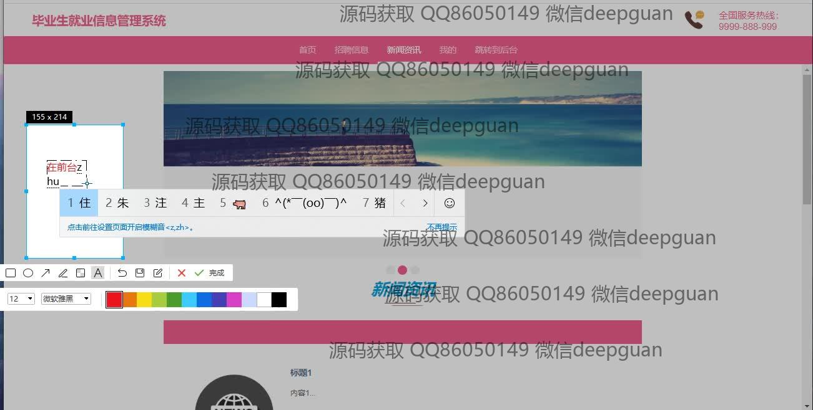
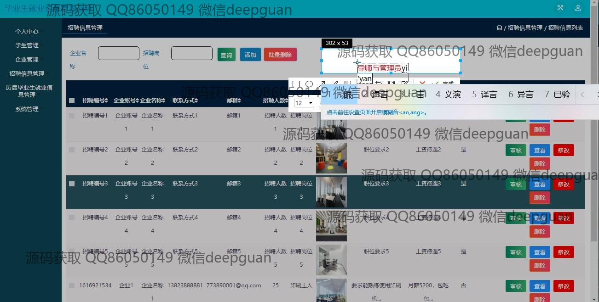
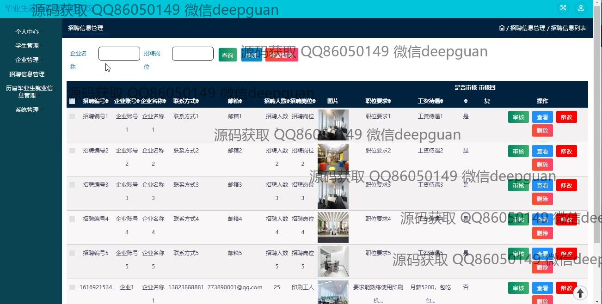

<h1 align="center">的毕业生就业信息管理</h1>

## 简介
毕业生就业信息管理系统：角色分为学生、就业导师、企业和管理员；功能包括招聘信息管理、学生管理、企业管理、面试邀请管理和新闻资讯模块。    --计算机毕业设计源码；毕设源码；java毕业设计源码

## 联系方式

<h3 align="center">获取完整代码与数据库文件 + 微信：deepguan QQ: 86050149 QQ群: 783742310</h3>

<h3 align="center">可帮忙远程部署 包运行成功！提供远程部署、修改代码、设计文档指导、代码讲解等服务！</h3>

## 功能介绍（完整见运行截图）
管理员：负责系统的整体运维和管理，包括信息的审核和修改。可以添加、删除和编辑招聘信息、企业信息和学生信息。管理员能通过面试邀请管理功能查看和调整邀请记录。此外，管理员可以查看详细的报表信息，并具有角色分配和权限管理的能力，确保系统的平稳运行和数据安全。

学生：可以在系统中注册和登录个人账户，填写和修改个人基本信息以及简历内容。学生能够查看和搜索招聘信息，并投递简历。系统也提供面试邀请管理功能，学生可以查看收到的面试邀请详情和状态。整个流程帮助学生更有效地管理和追踪求职过程。

企业：企业可在系统中注册账户并录入企业信息和招聘需求。企业可以浏览查询学生信息，并向合适的候选人发送面试邀请。招聘管理功能支持企业查看和管理招聘进展，包括职位信息的编辑和审核。此模块帮助企业高效地进行人才招募和管理。

就业导师：可以登录系统查看学生的求职状态，提供相应的指导。导师拥有查看企业招聘信息和学生投递记录的权限，能够为学生提供个性化的就业建议。系统为导师与学生、企业间的互动提供了桥梁，确保毕业生获得充分的就业支持。

## 运行截图

本代码来源于网络,仅供学习参考使用!

